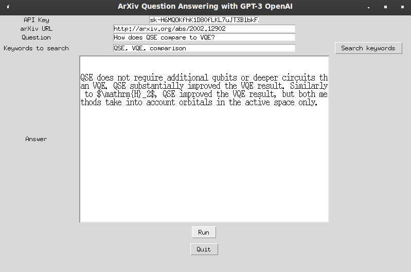
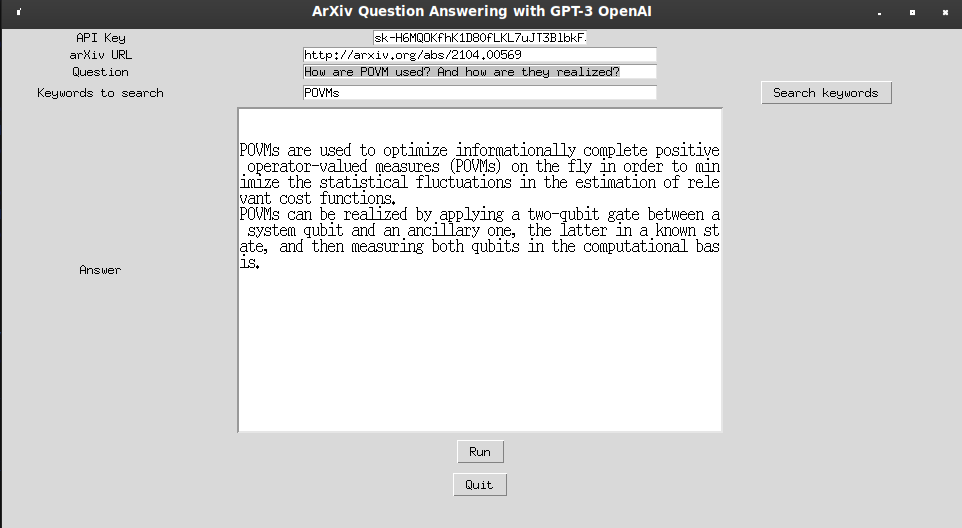

# PaperGenie

# API KEY 
To make use of the program you need an API KEY from OpenAI.
To do that, you can make an account for free at https://beta.openai.com/ (where you will have 18$ for free to try it out for hundreds of trial)
Once you have the account you can find your APIKEY under Personal-View API Keys.

# Libraries
You also may need to install the openai library: `pip install openai` 
and other libraries: tkinter, wget, pathlib, urllib

# Run and Usage

To run the program, simply run the command: python UI.py.

The tool downloads both the PDF and tar.gz containing the source files from arxiv.org. This includes the .tex file.
You can either ask the engine to search for keywords based on the question prompted, or insert/add keywords yourself. 
These will be searched for in the paper`s tex file and the matching phrases used to inquire the question to the GPT3 engine.

If no keywords are found in the text, the program will output 'No answer found.'

Examples:

